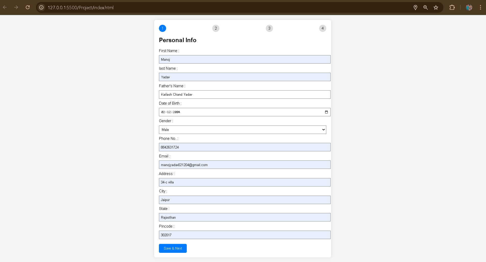
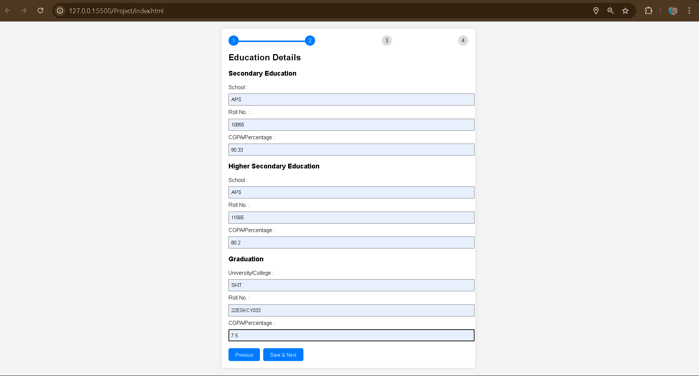
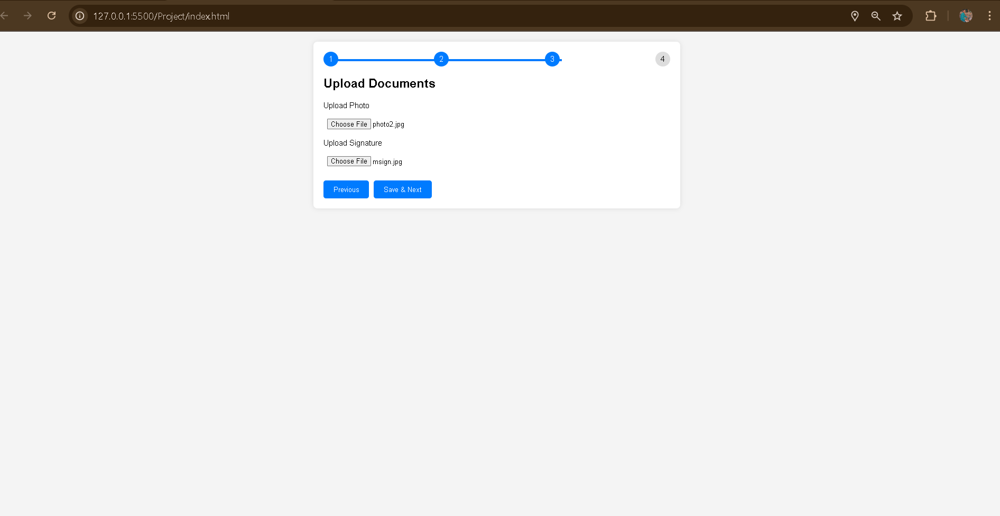
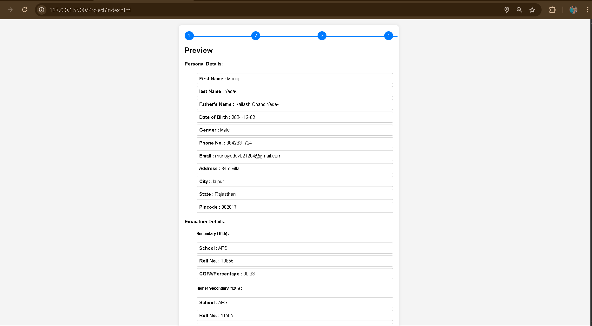
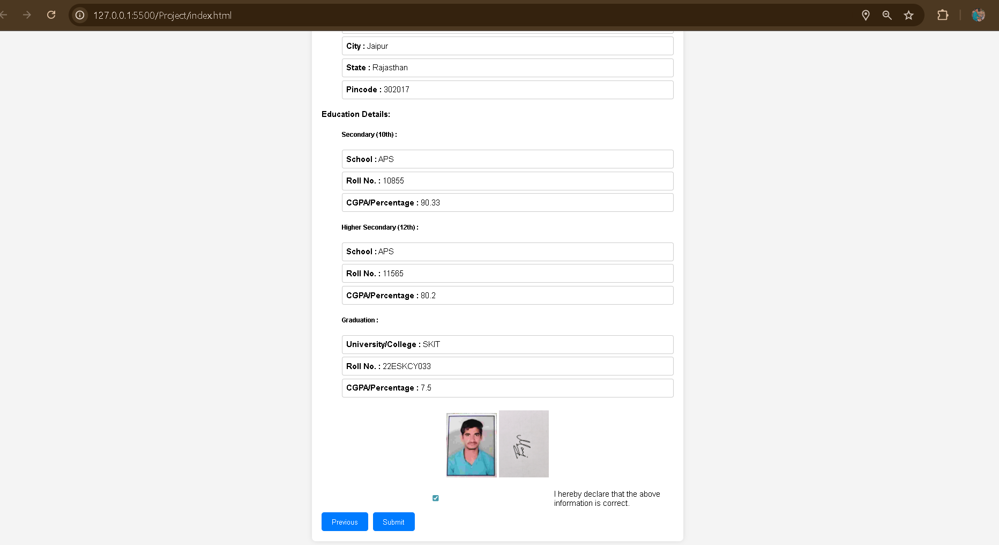
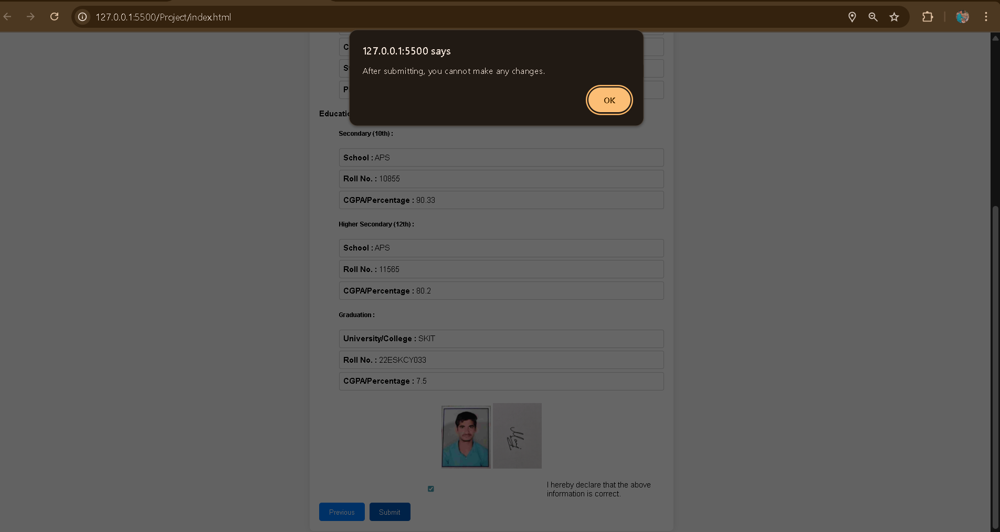

# CSI_Project
### Stepper Form 🚀

A multi-step smart form with validation and preview, built using **HTML, CSS, and JavaScript**. This project is ideal for applications like admission forms, government registrations, or internship applications.

---

## ✨ Features

- 📋 Multi-Step Form with "Save & Next" buttons
- ✅ Field-by-field Validation before proceeding
- 🖼 Live Preview of entered information
- 📸 Upload and preview **Photo** and **Signature**
- 👁‍🗨 Final Preview section with:
  - Personal Details
  - Educational Details (Secondary, Higher Secondary, Graduation)
  - Uploaded Photo and Signature
- ☑️ Declaration checkbox validation
- 🧾 Submit and Reset functionality
- 📄 Download as **PDF** on submission
- 🔐 DOB restricted to valid dates only (between 1950 and 2007)
- 💻 Responsive and professional layout

---

## 🛠 Tech Stack

- **HTML5**
- **CSS3**
- **JavaScript**

---

## 📂 Folder Structure

smart-stepper-form/
│
├── index.html # Main HTML file
├── style.css # Styling
├── script.js # Form logic and validation
└── README.md # This file

---

## 🚀 How to Use

1. **Clone the repository** or download the ZIP.
2. Open `index.html` in your browser.
3. Fill the form step-by-step. You cannot proceed without completing required fields.
4. Preview your data at the end.
5. Click ✅ "Submit" .

---

## 🚀 Live Demo

🔗 [Click here to view the live demo](https://manoj0212-rgb.github.io/CSI_Project/)

---

### 1️⃣ Step 1 – Personal Details  

### 2️⃣ Step 2 – Educational Details  

### 3️⃣ Step 3 – Upload Photo & Signature  

### 4️⃣ Final Preview with All Details  

---

## 📌 Notes

- The form restricts **DOB** to realistic ranges (1950 - 2007).
- Declaration **must be checked** before submission.

---

## 📧 Author

Manoj Yadav  
Web Developer | Celebal Technologies  

---

## 📃 License

This project is open-source and free to use for educational and personal projects.
